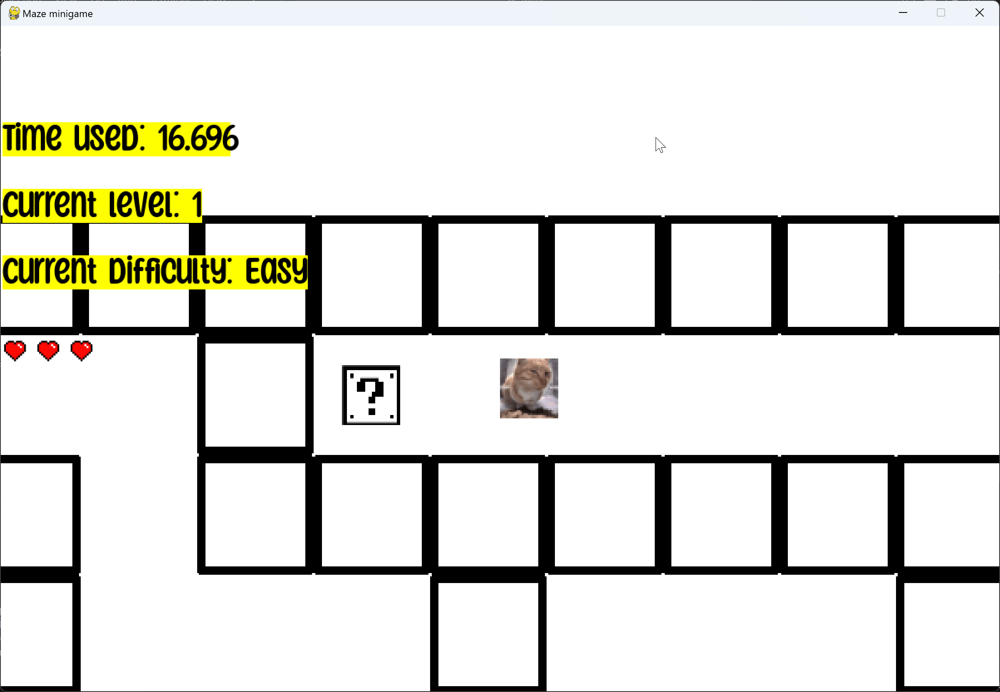
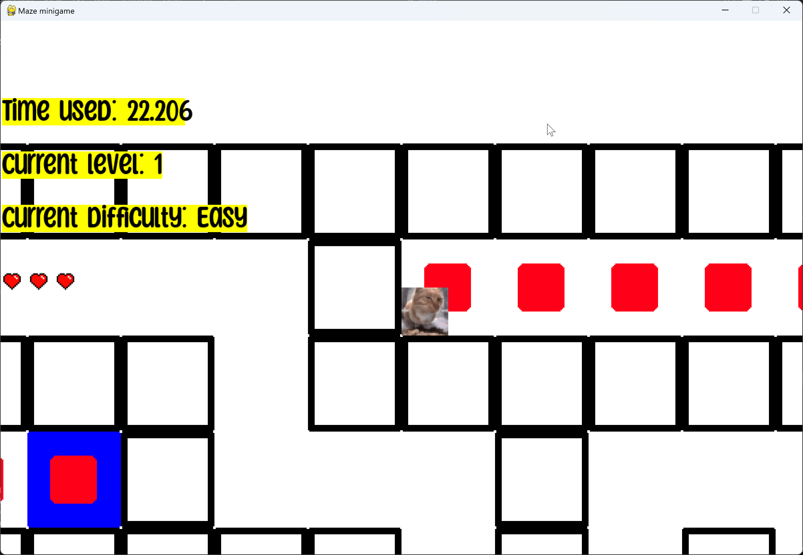
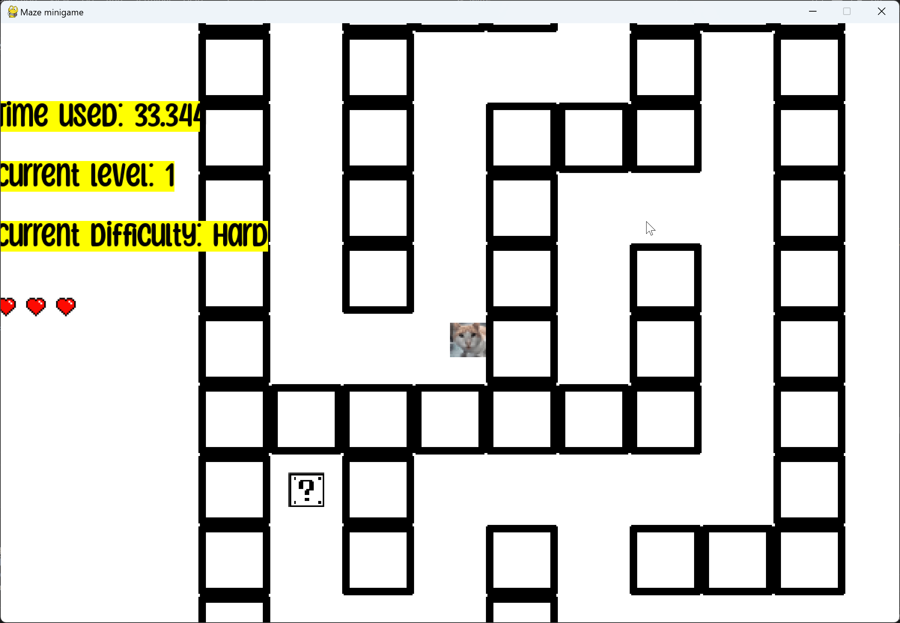

# Maze-game

## To play the game, launch **MazeMiniGame.bat**

(Regarding why I didnt use docker, I realized that docker containers do not provide built in ways to play audio so I decided to just use python os to deal with packages by setting up virtual environment in user machine)

This is a minigame where player needs to reach the goal (the blue rectangle) of the maze in the shortest time possible while avoiding monsters or traps, with assistance of items (monsters/traps WIP)

Use _WASD/arrow_ keys to control the player or change options. 
Press _enter_ if you want to apply an option. 
Press _escape_ to return to the previous menu/pause the game.

## Game scene

# Documentation

The following elements are devised and will be added soon:

1. change maze generation algorithm so that multiple paths can lead to the same position
2. set up traps, items(which provides temporary debuff/buff like displaying the path to the goal) etc.

Graphics might be improved in the future (probably)
BGMs are from undertale

manage.py: to automatically install virtual environment for the game  
requirements.txt: the required packages/libraries
main.py: main game script  
makemaze.py: generate maze according to the given arguments  
dfs.py: to generate maze with depth-first-search algorithm  
Astar_search.py: uses A\* algorithm to find the path to goal (For more details, refer to my repository: https://github.com/ngngka1/Astar_path_finding) 
maze_map.json: to store the generated maze_map  
config.toml: store game configuration (screen property, settings etc.)  
level_properties.toml: specify the level difficulty etc. of each level  
UI_options.json: contains UIs' options and instance(which will be created in runtime)
